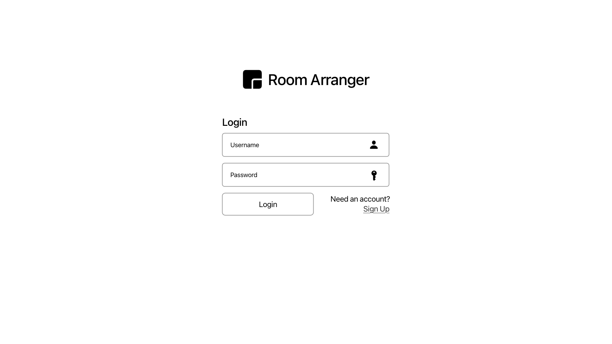
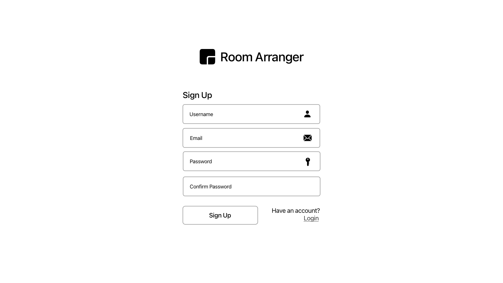
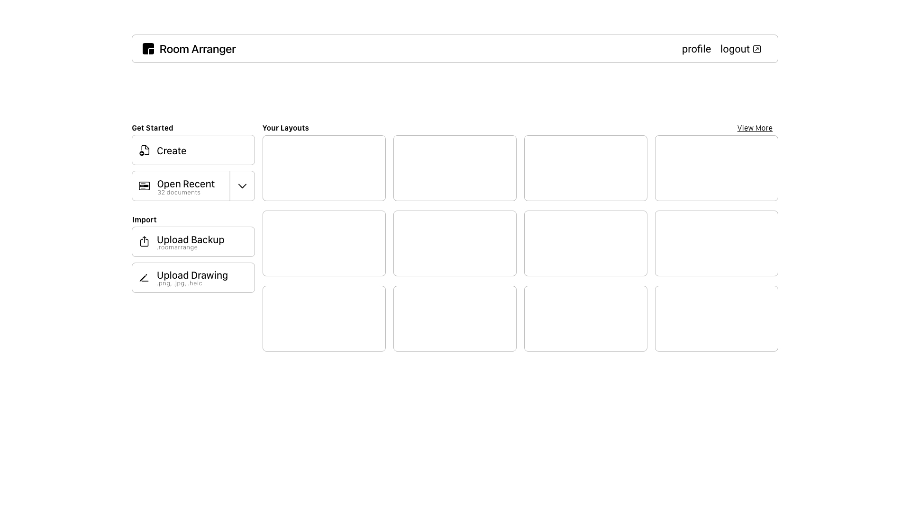
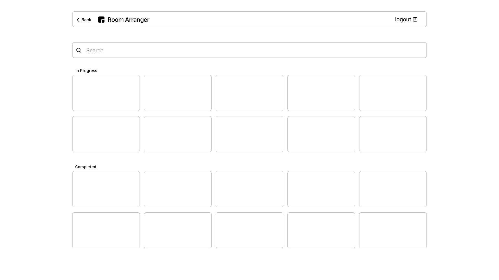
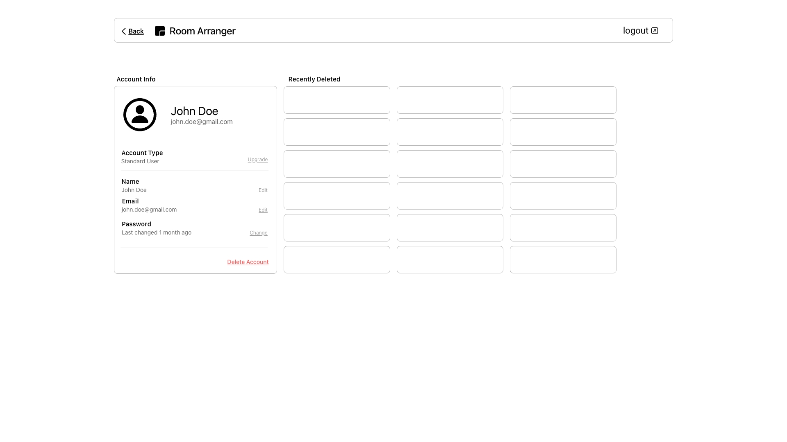
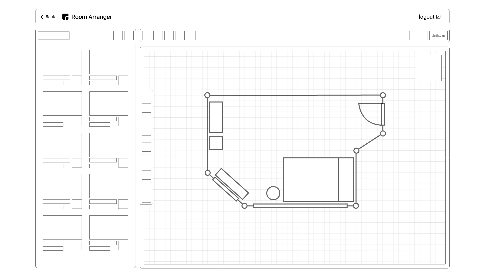
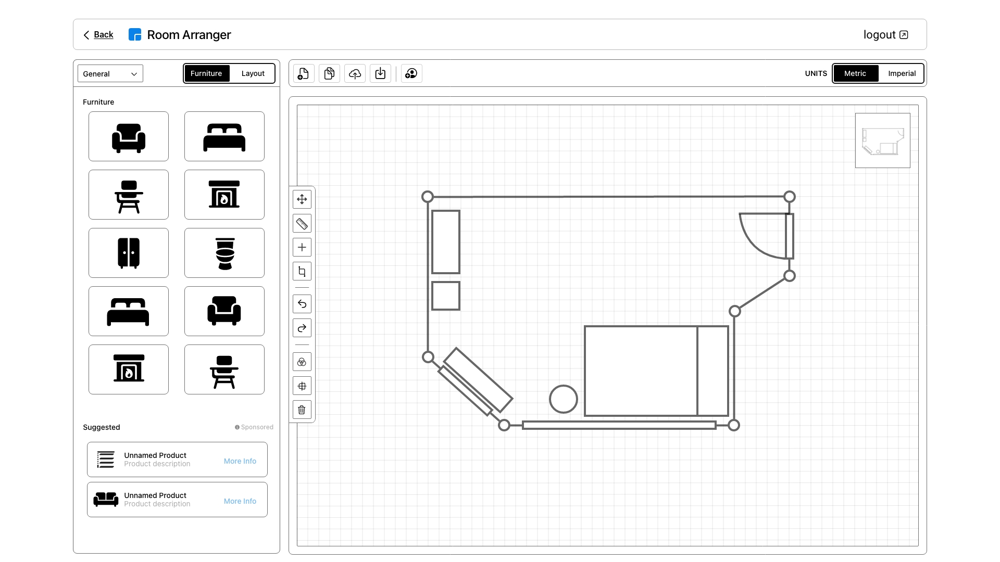
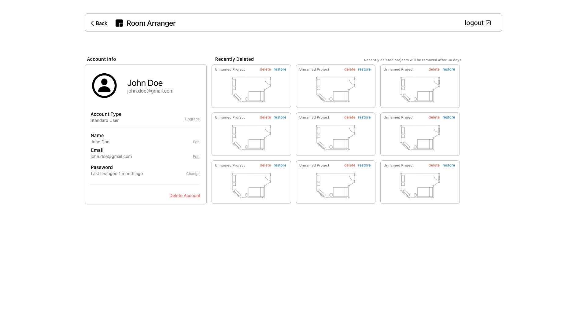
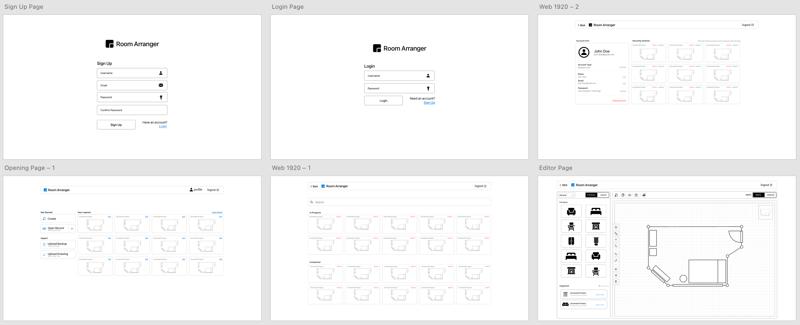

## Wireframes

**Original Wireframes (Used for user/SE feedback)**

[Revision 1](original.pdf)

**Revised Wireframes (Based on feedback)**

[Revision 2](revision-2.pdf)

### Login / Signup

One of the first views the user will see when interacting with the website is a login or register page. By default the
user will first be sent to the login page. If the user does not have an account, they may create one by clicking "Sign
Up" on the Login page.

### Home Page

Once the user is logged in, they can see a brief overview of their account's project history, if they have any. This
page also serves as a directory for creating, importing, and editing floor plan layouts.

### Search Page

Users may find the seatch page by selecting "View More" on the left side of the "Your Layouts" section of the home page.
This page shows the complete non-truncated listing of the account projects. A user may search for a previous project, or
a project shared with them using the search bar.

### Profile Page

Should a user wish to change details about their account, or recover recently deleted projects, they can find it in the
profile page. The profile page can only be accessed from the home page by selecting "Profile" in the nav bar.

### Editor Page

The editor page is one of the most important parts of the website and design. The editor allows users to create their
floor plan layout and add furniture. This page can be reached by performing any action that edits, creates, or uploads a
floor plan layout.
Most of the page is non-functional in the wireframe layout due to the lack of feature support in AdobeXD. In later
revisions of this floor plan, we implemented more icons, text, and images to provide visual hints toward what each of
the boxes is used for.

## Revision 2

### Editor

We made significant changes to the editor page after the initial student walkthrough. We include more icons and images
that have a more clear purpose. We also implemented various features to make the page look more usable.

### Profile

We added more descriptive imagery and verbiage to the profile page to provide better clues as to how the page will
behave for the user.

### All Revisions

We also made small cosmetic changes to add more visual clues. These changes mostly involved adding placeholder layouts
and links. We also began to stylize the components.

